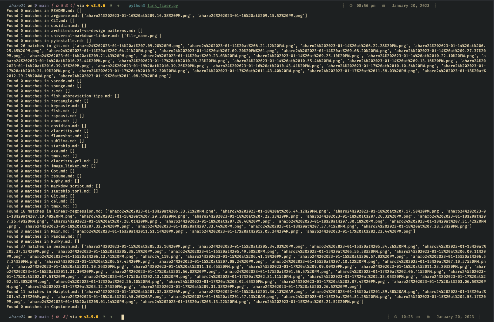

<h1 align="center"><b> Angel J. Haro 

</h1>

<!-- START  -->

&nbsp;
&nbsp;
&nbsp;
&nbsp;
&nbsp;
 

  
<!-- END -->

<h1 align="center"> <a href=https://aharoj.io> Visit Portfolio </a> </h1>

# Universal Markdown Linker
I'm excited to announce the release of my open-source tool, Universal Markdown Linker! As the founder and solo developer, I've poured countless hours into creating a reliable and efficient tool that makes linking markdown without the struggle of manually linking the files path manually. With over 1,500 lines of code and countless hours of testing, I've made sure that this script is stable and ready for use. Actively developing new features such as adding CLI support, dry run option, and progress bar. Also, planned features such as error handling, command line argument parser, and backup options.v Not only do I believe in the power of open-source, but I also believe in giving back to the community. I hope that my tool can make a positive impact and save others time and energy. Feel free to reach out to me with any questions, improvements, or just to chat.

#### linking 96 files in 5 seconds

### Author
-  This tool was developed and is maintained by [Angel Haro](https://www.linkedin.com/in/aharo24/), the founder of Universal Markdown Linker."

## Supported apps

-   Obsidian
-   Evernote
-   OneNote
-   Notion
-   Typora
-   Turtl
-   ZimWiki
-   Standard Notes
-   Joplin
-   Boostnote
-   Simplenote
-   Laverna
-   Joplin
-   Bear
-   Turtl
-   Joplin
-   Simplenote
-   Standard Notes
-   Zim
-   JotterPad
-   nvAlt
-   Roam Research
-   Simplenote
-   Standard Notes

## Features
#### Actively developing
-   Adding CLI support
-   Add a progress bar to show the user the progress of the script.
-   An option to dry run the script without making any changes to the files.
-   An option to check the number of changes made to the files.

#### Planned features 
-   Error handling to handle cases where the input files are not found or are not in the expected format.
-   A command line argument parser to make it easy for the user to specify the input and output directories.
-   An option to backup the original files before modifying them.
-   A progress bar to show the user the progress of the script.
-   An option to recursively search for files only in specific subdirectories.
-   An option to only search for specific file types other than .md
-   An option to search for a different pattern other than ``
-   An option to specify the new_path in the replacement, instead of calculating it in the script.

## Requirements
-   Python 3
-  ... (in progress)

## Installs
...(in progress)

## Developer Notes on Script Functionality

-   The script starts by setting the "workspace_root" variable to the current working directory, and then sets the "base_dir" variable to "." and the "attachment_dir" variable to "z".
-   It then uses the `os.walk` function to recursively search for .md files in all subdirectories
-   For each file it opens it in read mode and reads the contents into a string.
-   Then the script uses a regular expression to find all instances of the pattern `` in the contents of the file.
-   After that it iterates through the matches and replaces them with the desired pattern `` by adding the relative path to the attachment directory to the front of the file name.
-   Finally, it opens the file in write mode and writes the modified contents back to the input file.

